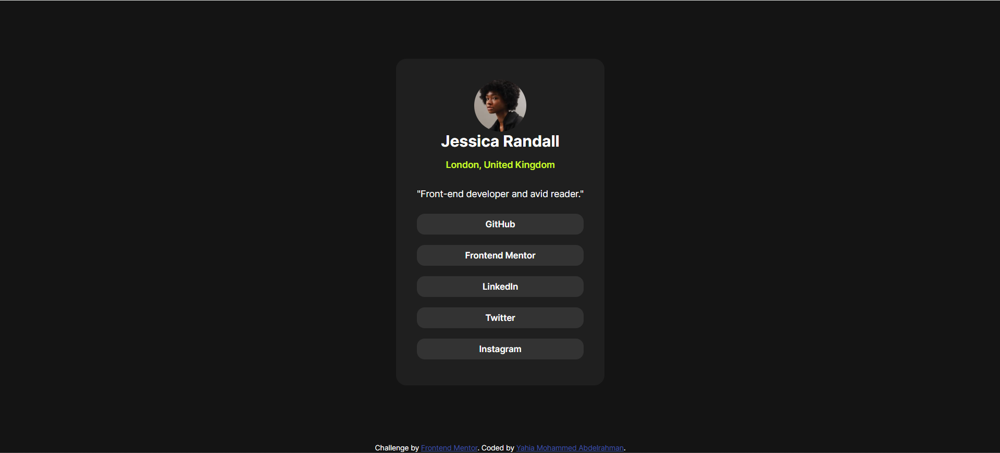
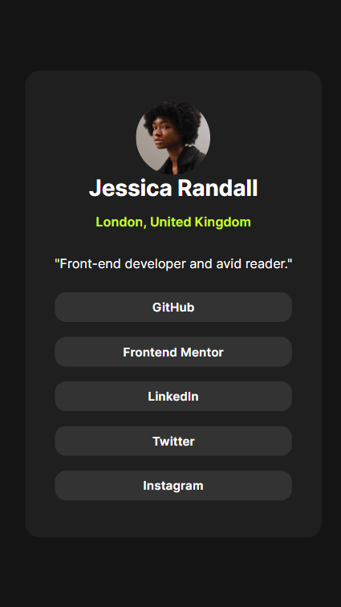

# Frontend Mentor - Social links profile solution

This is a solution to the [Social links profile challenge on Frontend Mentor](https://www.frontendmentor.io/challenges/social-links-profile-UG32l9m6dQ). Frontend Mentor challenges help you improve your coding skills by building realistic projects.

## Table of contents

- [Overview](#overview)
  - [The challenge](#the-challenge)
  - [Screenshots](#screenshot)
  - [Links](#links)
- [My process](#my-process)
  - [Built with](#built-with)
  - [What I learned](#what-i-learned)
  - [Continued development](#continued-development)
- [Author](#author)

## Overview

In this small project, I built social link-sharing profile.

### The challenge

Users should be able to:

- See hover and focus states for all interactive elements on the page

### Screenshot



### Mobile Screenshot



### Links

- Solution URL: [https://github.com/yahia5034/Social-links-profile](https://github.com/yahia5034/Social-links-profile)
- Live Site URL: [https://yahia5034.github.io/Social-links-profile/](https://yahia5034.github.io/Social-links-profile/)

## My process

I have used a custom library for styling
It is very usefull easier and faster. (Prime Flex) you can find link bellow.

### Built with

- Semantic HTML5 markup
- CSS custom properties
- Flexbox
- CSS Grid
- Mobile-first workflow
- [Prime Flex](https://primeflex.org/) - Prime Flex For Styles

### What I learned

I learned about using installed fonts using font-face

```css
@font-face {
  font-family: "bold";
  src: url("./assets/fonts/static/Inter-Bold.ttf");
}
```

I am also proud of using a library for styling Prime Flex which is like bootstrap .
How it works ?
you import the cdn and then use the class and voila it works.
like this.

```
  <div
        class="content p-5 border-round-2xl bg-gray-800 flex flex-column align-items-center justify-content-center"
      >
```

### Continued development

I will focus on continuing development of webpages and practice alot, while using new but helpfull topics, like primeflex, media queries and so more.

## Author

- [yahia]
- Frontend Mentor - [@yahia5034](https://www.frontendmentor.io/profile/yahia5034)
